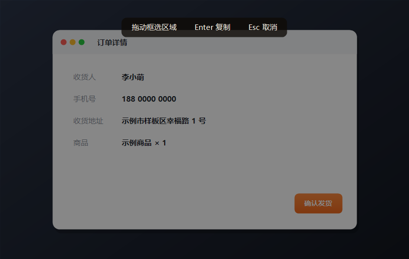

<p align="right"><b>English</b> · <a href="README.zh-CN.md">中文</a></p>

<p align="center">
  
</p>

<h1 align="center">AltSnip</h1>

<p align="center">
  <b>Press <code>Alt&nbsp;+&nbsp;A</code>. Drag a box. It's on your clipboard.</b><br>
  A tiny, fast, no-dependency screenshot &amp; annotation tool for Windows — in a single ~50&nbsp;KB <code>.exe</code>.
</p>

<p align="center">
  
  
  
  
</p>

<p align="center">
  
</p>

<p align="center">
  <sub>↑ animated (APNG) — plays in any modern browser</sub>
</p>

---

## Why AltSnip?

I built this in an afternoon because WeChat froze while I was trying to grab a screenshot and I'd had enough. It turns out a genuinely nice snipping tool is about one C# file — so here it is, free for everyone.

- ⚡ **Instant** — one global hotkey, `Alt + A`, from anywhere. No launch, no menus.
- 🪶 **Featherweight** — a single ~50 KB executable. No installer, no runtime download, nothing to configure. It uses the .NET Framework that already ships with Windows.
- 🎯 **Actually useful** — annotate, blur secrets, copy or save, all before you let go of the mouse.

## Features

- **One hotkey** — `Alt + A` freezes the screen and dims it; your selection stays crisp with a live pixel-size readout.
- **Adjust the box** — drag inside to move it, grab any of the 8 handles to resize, or drag outside to start over. No more "close and redo".
- **Annotate** — arrow, line, rectangle, text, and mosaic tools in a clean, borderless toolbar.
- **Colors & thickness** — 7 preset colors and 3 line widths, one click away.
- **Mosaic / blur** — drag over a phone number, face, or token to pixelate it before you share.
- **Text with IME** — click, get a red caret, and type — Chinese and other input methods work, on a transparent background.
- **Copy or save** — ✓ (or `Enter`) copies to the clipboard; the save button exports a PNG.
- **Cancel any way you like** — ✗, `Esc`, right-click, or just press `Alt + A` again.
- **Multi-monitor** — works across every display, and the toolbar always stays on screen.
- **Tray-resident** — double-click the tray icon to snip, right-click to quit.

## Get started

1. Download `Snip.exe` from the [latest release](../../releases/latest).
2. Double-click it — it tucks into your system tray.
3. Press `Alt + A` and drag.

Want it always ready? Put a shortcut to `Snip.exe` in your startup folder:

```
Win + R  →  shell:startup  →  drop a shortcut to Snip.exe in there
```

> Heads-up: WeChat's default screenshot shortcut is also `Alt + A`. AltSnip uses a low-level keyboard hook so it wins that key no matter who registered it first — no settings to change.

## Shortcuts

| Key / action | What it does |
| --- | --- |
| `Alt + A` | Start a capture (or cancel one that's open) |
| Drag | Select a region |
| Drag inside / handles | Move / resize the selection |
| `Enter` or ✓ | Copy to clipboard |
| Save button | Export as PNG |
| `Ctrl + Z` / undo | Remove the last annotation |
| `Esc` · right-click · ✗ | Cancel |

## Platform

The stable build is **Windows** (Windows 8+) — the tiny single-file `.exe` above.

A ground-up **cross-platform rewrite** (Avalonia) for **Windows / macOS / Linux** is
in progress on the [`cross-platform`](../../tree/cross-platform) branch, with early
binaries in the [`cross-preview`](../../releases/tag/cross-preview) prerelease. It's
feature-complete (select, annotate, mosaic, copy, save) and the Windows build is
smoke-tested; macOS/Linux still need real-hardware testing. See
[cross/README.md](cross/README.md).

## Build from source

No Visual Studio needed — Windows already ships the C# compiler.

```powershell
powershell -ExecutionPolicy Bypass -File build.ps1
```

The app icon is generated by `tools/IconGen.cs`; the demo animation by `tools/DemoGen.cs`.

## How it works

On the hotkey, the whole virtual screen (all monitors) is copied into a bitmap. An overlay shows that frozen bitmap dimmed, with your selection drawn back in at full brightness; annotations are painted on top and burned into the final image on confirm. Because the background is frozen, nothing you do disturbs the underlying apps. The `Alt + A` hotkey is captured with a `WH_KEYBOARD_LL` hook — it only checks for that one combo and logs nothing.

## License

[MIT](LICENSE) — do whatever you want with it.
