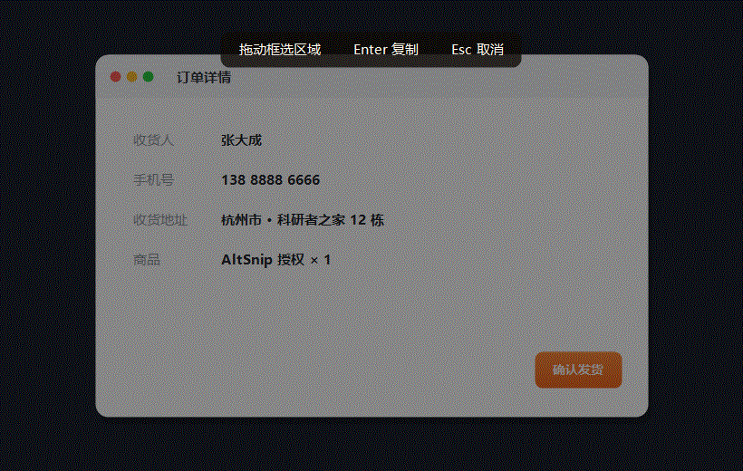

<p align="center">
  
</p>

<h1 align="center">AltSnip</h1>

<p align="center">
  <b>Press <code>Alt&nbsp;+&nbsp;A</code>. Drag a box. It's on your clipboard.</b><br>
  A tiny, fast, no-dependency screenshot &amp; annotation tool for Windows — in a single ~50&nbsp;KB <code>.exe</code>.
</p>

<p align="center">
  
  
  
  
</p>

<p align="center">
  
</p>

---

## Why AltSnip?

I built this in an afternoon because WeChat froze while I was trying to grab a screenshot and I'd had enough. It turns out a genuinely nice snipping tool is about one C# file — so here it is, free for everyone.

- ⚡ **Instant** — one global hotkey, `Alt + A`, from anywhere. No launch, no menus.
- 🪶 **Featherweight** — a single ~50 KB executable. No installer, no runtime download, nothing to configure. It uses the .NET Framework that already ships with Windows.
- 🎯 **Actually useful** — annotate, blur secrets, copy or save, all before you let go of the mouse.

## Features

- **One hotkey** — `Alt + A` freezes the screen and dims it; your selection stays crisp with a live pixel-size readout.
- **Adjust the box** — drag inside to move it, grab any of the 8 handles to resize, or drag outside to start over. No more "close and redo".
- **Annotate** — arrow, line, rectangle, text, and mosaic tools in a clean, borderless toolbar.
- **Colors & thickness** — 7 preset colors and 3 line widths, one click away.
- **Mosaic / blur** — drag over a phone number, face, or token to pixelate it before you share.
- **Text with IME** — click, get a red caret, and type — Chinese and other input methods work, on a transparent background.
- **Copy or save** — ✓ (or `Enter`) copies to the clipboard; the save button exports a PNG.
- **Cancel any way you like** — ✗, `Esc`, right-click, or just press `Alt + A` again.
- **Multi-monitor** — works across every display, including negative-coordinate layouts.
- **Tray-resident** — double-click the tray icon to snip, right-click to quit.

## Get started

1. Download `Snip.exe` from the [latest release](../../releases/latest).
2. Double-click it — it tucks into your system tray.
3. Press `Alt + A` and drag.

Want it always ready? Put a shortcut to `Snip.exe` in your startup folder:

```
Win + R  →  shell:startup  →  drop a shortcut to Snip.exe in there
```

> Heads-up: WeChat's default screenshot shortcut is also `Alt + A`. AltSnip uses a low-level keyboard hook so it wins that key no matter who registered it first — no settings to change.

## Shortcuts

| Key / action | What it does |
| --- | --- |
| `Alt + A` | Start a capture (or cancel one that's open) |
| Drag | Select a region |
| Drag inside / handles | Move / resize the selection |
| `Enter` or ✓ | Copy to clipboard |
| Save button | Export as PNG |
| `Ctrl + Z` / undo | Remove the last annotation |
| `Esc` · right-click · ✗ | Cancel |

## Build from source

No Visual Studio needed — Windows already ships the C# compiler.

```powershell
powershell -ExecutionPolicy Bypass -File build.ps1
```

The app icon is generated by `tools/IconGen.cs`; the demo GIF by `tools/DemoGen.cs`.

## How it works

On the hotkey, the whole virtual screen (all monitors) is copied into a bitmap. An overlay shows that frozen bitmap dimmed, with your selection drawn back in at full brightness; annotations are painted on top and burned into the final image on confirm. Because the background is frozen, nothing you do disturbs the underlying apps. The `Alt + A` hotkey is captured with a `WH_KEYBOARD_LL` hook — it only checks for that one combo and logs nothing.

## License

[MIT](LICENSE) — do whatever you want with it.

---

<h1 align="center">AltSnip · 中文</h1>

<p align="center"><b>按 <code>Alt&nbsp;+&nbsp;A</code>,拖个框,截图就进了剪贴板。</b><br>
一个极简、快速、零依赖的 Windows 截图 + 标注工具,全部装在一个约 50&nbsp;KB 的 <code>.exe</code> 里。</p>

## 为什么做它

某天微信卡死,我想截个图都截不了,一怒之下自己写了这个。发现一个真正好用的截图工具也就一个 C# 文件的量,于是开源出来,免费给所有人用。

- ⚡ **秒起** —— 全局热键 `Alt + A`,在哪都能唤起,不用找、不用点菜单。
- 🪶 **极轻** —— 单文件约 50 KB,没有安装包、不下运行时、无需配置,用的是 Windows 自带的 .NET Framework。
- 🎯 **真好用** —— 标注、打码、复制或保存,松手之前一气呵成。

## 功能

- **一个热键** —— `Alt + A` 冻结并压暗屏幕,选区保持清晰,实时显示像素尺寸。
- **调整选框** —— 框内拖动整体移动,拖 8 个控制点缩放,框外拖动重新框选。截歪了不用重来。
- **标注** —— 箭头、直线、方框、文字、马赛克,无边框极简工具条。
- **颜色和粗细** —— 7 种预设颜色 + 3 档线宽,一点即换。
- **马赛克打码** —— 框住手机号、人脸、密钥一拖即打码,分享前遮好。
- **文字(支持输入法)** —— 点一下出红色光标直接打字,中文照常,背景透明。
- **复制或保存** —— ✓(或 `Enter`)复制到剪贴板,保存按钮导出 PNG。
- **多种取消** —— ✗、`Esc`、右键,或再按一次 `Alt + A`。
- **多显示器** —— 覆盖所有屏幕,含负坐标布局。
- **托盘常驻** —— 双击托盘图标截图,右键退出。

## 快速开始

1. 从 [最新发布](../../releases/latest) 下载 `Snip.exe`。
2. 双击运行,它会待在系统托盘里。
3. 按 `Alt + A` 拖框即可。

想开机自启:把 `Snip.exe` 的快捷方式放进启动文件夹 —— `Win + R` 输入 `shell:startup`,拖进去即可。

> 提醒:微信的截图默认快捷键也是 `Alt + A`。AltSnip 用底层键盘钩子拦截,谁先抢注都无效,不用改任何设置。

## 快捷键

| 按键 / 操作 | 作用 |
| --- | --- |
| `Alt + A` | 开始截图(已打开则取消) |
| 拖动 | 框选区域 |
| 框内拖动 / 控制点 | 移动 / 缩放选框 |
| `Enter` 或 ✓ | 复制到剪贴板 |
| 保存按钮 | 导出 PNG |
| `Ctrl + Z` / 撤销 | 删除上一笔标注 |
| `Esc` · 右键 · ✗ | 取消 |

## 许可协议

[MIT](LICENSE) —— 随便用。
